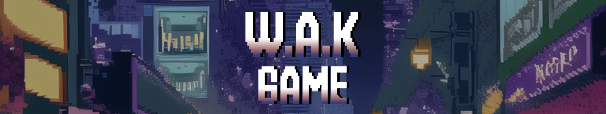
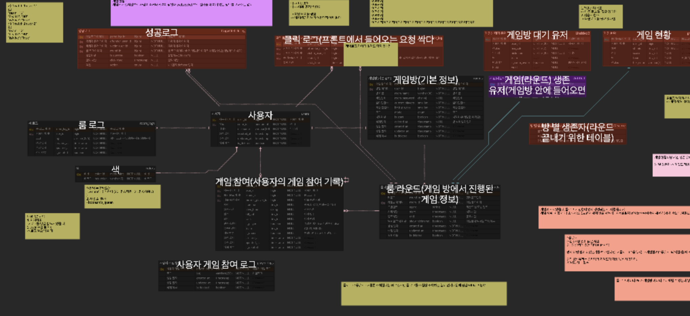

<table>
  <tbody>
    <tr>
        <td align="center">
            <a href="https://github.com/ryuu9505">
            
                 
                <b>조형준</b>
            </a>
             
            BE
        </td>
        <td align="center">
            <a href="https://github.com/olnuyh">
            
                 
                <b>김이현</b>
            </a>
             
            BE
        </td>
        <td align="center">
            <a href="https://github.com/fkdusrh">
            
                 
                <b>김라연</b>
            </a>
             
            BE
        </td>
        <td align="center">
            <a href="https://github.com/slcloe">
            
                 
                <b>김한슬</b>
            </a>
             
            BE
        </td>
        <td align="center">
            <a href="https://github.com/annyoon">
            
                 
                <b>윤서안</b>
            </a>
             
            FE
        </td>
        <td align="center">
            <a href="https://github.com/minwoo-kwak">
            
                 
                <b>곽민우</b>
            </a>
             
            Infra
        </td>
    </tr>
  </tbody>
</table>

 
 
 
 
 
 
 
 
 
 
 
 

#### 📃 목차

1. [프로젝트 소개](#-프로젝트-소개)   
2. [서비스 소개](#-주요-기능)  
<!-- 3. [팀 소개](#-팀-소개)   -->

 
 
 
 
 
 
 
 
 
 
 
 

# 📜 프로젝트 소개

실시간 웹 게임 개발 프로젝트

 

### 프로젝트 기간
2024.04.09 - 2024.05.19 (6주)

> **기획 및 설계** : 2024.04.09 - 2024.04.19 (2주)
>
> **기능 구현** : 2024.04.22 - 2024.05.19 (4주)

 
 
 
 
 
 
 
 
 
 
 
 

# 📑 서비스 소개 

**서비스 명** : WAK GAME

 

### 🧤 특징
    ✔ ...
    ✔ ...

 

### 🍿 기술 스택
|구분|기술|
|:---|:---|
|Infra|     |
|Frontend|   |
|Backend|     |
|Management Tool|    
|IDE| |

 

### 📃 설계

**인프라 아키텍쳐**

**백엔드 아키텍쳐**

**ERD 다이어그램**

**외부 문서**
- [와이어프레임](#)

 

### 🥾 주요 기능

|구분| 설명                                                                             | BE 담당 | FE 담당 |
|:---|:-------------------------------------------------------------------------------|:---|:---|
|인증| - ... |🐭김라연 🐱김한슬|🐹윤서안|
|게임| - ...  - ... |🐭김라연 🐱김한슬|🐹윤서안|
|채팅| - 실시간 채팅 |🐷조형준 🐰김이현|🐹윤서안|

 

### 🕊 실행방법

exec 폴더 내 포팅 메뉴얼 참조
